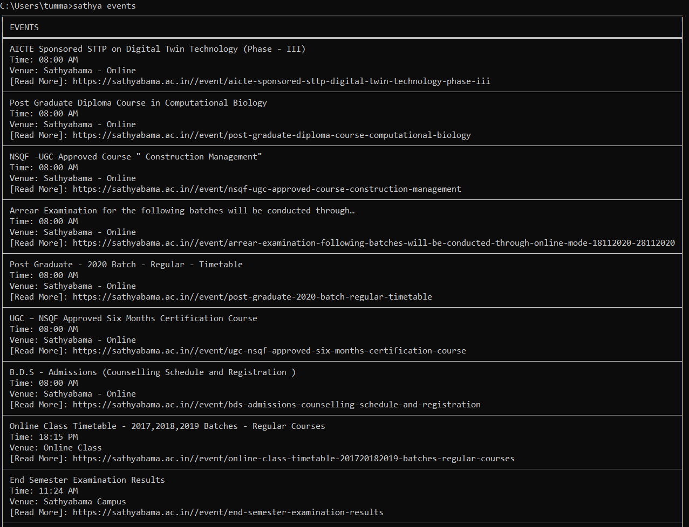

# Updates on Command Line

> *Fetch Latest updates from sathyabama-news-api and Pretty Print it on Terminal.*

<p align="center">  
</p><br />

## Install
```bash
python3 -m pip install sathyabama-updates
```

## Update
```bash
python3 -m pip install sathyabama-updates --upgrade
```

## Usage
```
C:\Users\>sathya --help
Usage: sathya [OPTIONS] SECTION

  Simple CLI for accessing sathyabama latest updates

Options:
  --section TEXT  What you want to see?  Just type the section
  --help          Show this message and exit.
```
```
sathya news
╒═════════════════════════════════════════════════════════════════════════════════════════════════════════════════════════════════════════╕
│ NEWS                                                                                                                                    │
╞═════════════════════════════════════════════════════════════════════════════════════════════════════════════════════════════════════════╡
│ Post Graduate - 2020 Batch - Regular - Timetable                                                                                        │
│ Tue, 11/17/2020 - 08:00                                                                                                                 │
│ [Read More]: https://sathyabama.ac.in/news/post-graduate-2020-batch-regular-timetable                                                   │
├─────────────────────────────────────────────────────────────────────────────────────────────────────────────────────────────────────────┤
│ Arrear Examination for the following batches will be conducted through ONLINE Mode from 18.11.2020 to 28.11.2020.                       │
│ Fri, 11/06/2020 - 14:21                                                                                                                 │
│ [Read More]: https://sathyabama.ac.in/news/arrear-examination-following-batches-will-be-conducted-through-online-mode-18112020-28112020 │
├─────────────────────────────────────────────────────────────────────────────────────────────────────────────────────────────────────────┤
│ Sathyabama awarded with QS -  E Lead (E - Learning Excellence for Academic Digitisation)                                                │
│ Fri, 10/23/2020 - 18:33                                                                                                                 │
│ [Read More]: https://sathyabama.ac.in/news/sathyabama-awarded-qs-e-lead-e-learning-excellence-academic-digitisation                     │
├─────────────────────────────────────────────────────────────────────────────────────────────────────────────────────────────────────────┤
│ B.D.S - Admissions (Counselling Schedule and Registration )                                                                             │
│ Fri, 10/23/2020 - 14:01                                                                                                                 │
│ [Read More]: https://sathyabama.ac.in/news/bds-admissions-counselling-schedule-and-registration                                         │
├─────────────────────────────────────────────────────────────────────────────────────────────────────────────────────────────────────────┤
│ Consultancy Services  in Molecular Biology and Bioinformatics                                                                           │
│ Thu, 10/22/2020 - 08:00                                                                                                                 │
│ [Read More]: https://sathyabama.ac.in/news/consultancy-services-molecular-biology-and-bioinformatics                                    │
├─────────────────────────────────────────────────────────────────────────────────────────────────────────────────────────────────────────┤
│ AICTE sponsored STTP on "Futuristic Applications and Research Opportunities of Nanoelectronics in Bioscience"                           │
│ Sat, 10/17/2020 - 14:25                                                                                                                 │
│ [Read More]: https://sathyabama.ac.in/news/aicte-sponsored-sttp-futuristic-applications-and-research-opportunities-nanoelectronics      │
├─────────────────────────────────────────────────────────────────────────────────────────────────────────────────────────────────────────┤
```

## License
MIT © Manoj Tummala
